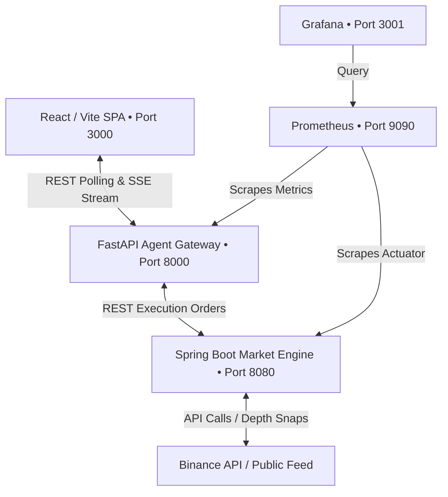

# OTTR HFT Cockpit: Polyglot Microservice System

OTTR is a high-frequency trading (HFT) quantitative dashboard for cryptocurrency markets. It utilizes a polyglot microservice architecture designed to handle real-time market data analytics, automated multi-agent consensus trade logic, and synthetic/real order book simulation.

---

## System Architecture Overview



### Polyglot Microservices

1. **Frontend (`/frontend`)**
   - **Stack**: React 19, Vite 6, Tailwind CSS v4, Lucide Icons.
   - **Role**: High-fidelity trading terminal cockpit. Automatically detects microservice gateway availability, falling back to a client-side web worker simulation if the gateway is offline.
2. **Agent Gateway (`/agent-gateway`)**
   - **Stack**: Python 3.12, FastAPI, Uvicorn, Pydantic v2, HTTPX, OpenAI SDK, SSE-Starlette.
   - **Role**: Coordinates the multi-agent consensus pipeline (Technical Analyst, Sentiment Analyst, Trader, Risk Auditor, Portfolio Manager). Computes Spent Output Profit Ratio (SOPR) UTXO calculations and serves Server-Sent Events (SSE).
3. **Market Engine (`/market-engine`)**
   - **Stack**: Java 21, Spring Boot 3.3.6, Gradle, Spring Actuator, Micrometer.
   - **Role**: Handles limit order book (LOB) construction, execution math (dynamic size-based slippage, Average True Range, H6 momentum scores), and dual-mode Binance API rate limiting.
4. **Observability Stack (`/monitoring`)**
   - **Stack**: Prometheus, Grafana.
   - **Role**: Scrapes API performance, order execution matching latencies, and sliding-window rate-limiter weight consumption.

---

## Directory Structure

```
d:\crypto-trading-bot/
├── frontend/                 # React SPA (Vite + Tailwind v4)
│   ├── src/                  # Components, API clients, TypeScript definitions
│   ├── Dockerfile
│   └── nginx.conf
├── agent-gateway/            # Python FastAPI Agent service
│   ├── app/                  # FastAPI routers, services, agents
│   ├── Dockerfile
│   └── pyproject.toml
├── market-engine/            # Java Spring Boot Matching Engine
│   ├── src/                  # LimitOrderBook, rate limiter, controller classes
│   ├── Dockerfile
│   └── build.gradle.kts
├── monitoring/               # Observability configurations
│   ├── prometheus.yml        # Scrape interval and target metrics config
│   └── grafana/              # Provisioned datasources & JSON dashboard templates
├── docker-compose.yml        # Orchestration configurations
├── .env.example              # Environment variables template
└── README.md                 # System documentation
```

---

## Quickstart: Run via Docker Compose

Make sure you have [Docker](https://www.docker.com/) and Docker Compose installed, then follow these steps:

1. **Configure Environment Variables**
   Copy the `.env.example` file and customize if needed:
   ```bash
   cp .env.example .env
   ```
   *Note: Binance API keys are optional. If left blank, the Market Engine falls back to public endpoints with a weight limit of 1,200/min. If configured, it enables authenticated endpoints with a limit of 6,000/min.*

2. **Launch the Containers**
   Build and start the entire microservice stack:
   ```bash
   docker compose up --build
   ```

3. **Access Services**
   - **React Cockpit**: [http://localhost:3000](http://localhost:3000)
   - **FastAPI Documentation**: [http://localhost:8000/docs](http://localhost:8000/docs)
   - **Market Engine Health Check**: [http://localhost:8080/api/v1/health](http://localhost:8080/api/v1/health)
   - **Prometheus UI**: [http://localhost:9090](http://localhost:9090)
   - **Grafana Metrics Dashboard**: [http://localhost:3001](http://localhost:3001) (Credentials: `admin` / `ottr`)

---

## Local Development Setup

If you prefer to run services individually without Docker:

### 1. Spring Boot Market Engine
Ensure you have **Java 21** installed:
```bash
cd market-engine
# Build and package
./gradlew bootJar
# Run the JAR
java -jar build/libs/market-engine-0.0.1-SNAPSHOT.jar
```
*Runs on port `8080`.*

### 2. Python Agent Gateway
Ensure you have **Python 3.12+** installed:
```bash
cd agent-gateway
# Create and activate a virtual environment
python -m venv .venv
source .venv/bin/activate # On Windows: .venv\Scripts\activate
# Install dependencies
pip install -e .
# Start the server
uvicorn app.main:app --host 127.0.0.1 --port 8000 --reload
```
*Runs on port `8000`.*

### 3. React Frontend
Ensure you have **Node.js 22+** installed:
```bash
cd frontend
# Install dependencies
npm install
# Start local development server
npm run dev
```
*Runs on port `3000` (Vite dev server proxied to the gateway).*

---

## LLM Gateway Handshake Configuration

The OTTR AI agents are **LLM-provider-agnostic** and do not use default hardcoded providers.
1. When you first launch the dashboard, the status badge will indicate **`LIVE`**, and the diagnostics sidebar will report **`LLM Not Configured`**.
2. Supply your local/remote LLM details in the **System parameters** sidebar:
   - **Host Endpoint URL**: e.g., `http://localhost:11434/v1` (for Ollama), `http://localhost:1234/v1` (for LM Studio), or `https://api.openai.com/v1`.
   - **Bearer Security Key**: Your API Key.
   - **Target Model ID**: e.g., `llama3.1:8b-instruct`, `mistral`, or `gpt-4o`.
3. Press **Initialize Diagnostic Handshake** to execute a handshake. If successful, the gateway connects the LLM client, runs a diagnostic ping, and triggers the cooperative multi-agent consensus room.

---

## Core Extensions & Features

### 1. Target Allocation Profile & Risk Vetoes
- The UI setting previously called "Mathematical Base Model" is renamed to **Target Allocation Profile** (Russian: *Целевой Профиль Аллокации*).
- The **Risk Auditor Agent** checks all consensus `BUY` orders against active strategy allocation weights with a **+5% soft buffer**:
  - **DD90/10**: BTC target = 81.8%, ETH target = 6.4%, Altcoins target = 2.7% per symbol.
  - **AdaptiveTrend**: BTC target = 54.5%, ETH target = 22.7%, Altcoins target = 13.6% per symbol.
  - Any buy order pushing holdings beyond `target_pct + 0.05` is vetoed with a descriptive telemetry notification.

### 2. Buying Power & Cash Balance Protection
- The Risk Auditor intercepts `BUY` actions to verify that the total transaction cost (in USD) does not exceed the currently available cash balance, preventing simulated cash from going negative.

### 3. Persistent Portfolio State & Startup Liquidation
- Saves all current portfolio state coordinates (cash, holdings, average cost, drawdown, and portfolio value) to `portfolio_state.json` inside the `agent-gateway/` folder.
- On backend boot/restart, the gateway automatically loads the saved state and performs a **Startup Liquidation** step (pretending all assets are sold for cash at the latest market prices) to carry forward your total net equity balance to the fresh session as unleveraged cash.

### 4. Desktop Batch Launcher
- A launcher batch script `run_crypto_bot.bat` is generated on the Desktop to launch the Java engine, FastAPI gateway, and Vite React SPA dev server in separate, logs-enabled command prompt windows, then auto-opens browser dashboard.

### 5. Enhanced Live Equity Charting
- **Interactive Timeframes**: Added selector buttons to switch the equity chart between `SEC` (seconds), `MIN` (minutes), `HOUR` (hours), `DAY` (days), and `WEEK` (weeks).
- **Time-based X-Axis**: Displays real-time, user-friendly localized timestamp labels on the X-axis instead of arbitrary index values.
- **Smart Aggregation**: Employs client-side downsampling to aggregate the master tick list (supporting up to 2,000 points) into the chosen intervals, providing a clear visualization of equity performance over time.
- **Larger Layout**: The main chart widget height has been increased to `350px` to offer a premium, highly readable terminal interface.

