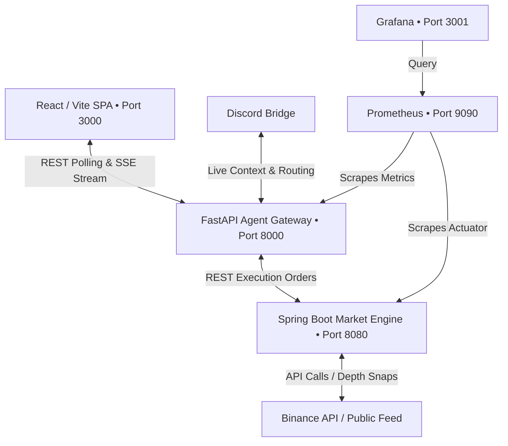

# OTTR HFT Cockpit: Polyglot Microservice System

OTTR is a high-frequency trading (HFT) quantitative dashboard for cryptocurrency markets. It utilizes a polyglot microservice architecture designed to handle real-time market data analytics, automated multi-agent consensus trade logic, and synthetic/real order book simulation.

---

## System Architecture Overview



### Polyglot Microservices

1. **Frontend (`/frontend`)**
   - **Stack**: React 19, Vite 6, Tailwind CSS v4, Lucide Icons.
   - **Role**: High-fidelity trading terminal cockpit. Automatically detects microservice gateway availability, falling back to a client-side web worker simulation if the gateway is offline.
2. **Agent Gateway (`/agent-gateway`)**
   - **Stack**: Python 3.12, FastAPI, Uvicorn, Pydantic v2, HTTPX, OpenAI SDK, SSE-Starlette.
   - **Role**: Coordinates the multi-agent consensus pipeline (Technical Analyst, Sentiment Analyst, Trader, Risk Auditor, Portfolio Manager). Computes Spent Output Profit Ratio (SOPR) UTXO calculations and serves Server-Sent Events (SSE).
3. **Market Engine (`/market-engine`)**
   - **Stack**: Java 21, Spring Boot 3.3.6, Gradle, Spring Actuator, Micrometer.
   - **Role**: Handles limit order book (LOB) construction, execution math (dynamic size-based slippage, Average True Range, H6 momentum scores), and dual-mode Binance API rate limiting.
4. **Discord Bridge (`/discord-bridge`)**
   - **Stack**: Python 3.12, Discord.py, SQLite, ChromaDB-style Vector Search.
   - **Role**: Connects the OTTR agents to a Discord channel (`#trading-floor`). Features a Live LLM Intent Router, short-term and long-term semantic memory, and a fully functional order book simulator.
5. **Observability Stack (`/monitoring`)**
   - **Stack**: Prometheus, Grafana.
   - **Role**: Scrapes API performance, order execution matching latencies, and sliding-window rate-limiter weight consumption.

---

## Directory Structure

```
d:\crypto-trading-bot/
├── frontend/                 # React SPA (Vite + Tailwind v4)
├── agent-gateway/            # Python FastAPI Agent service
├── market-engine/            # Java Spring Boot Matching Engine
├── discord-bridge/           # Discord AI Agent Hub (Memory, Router, Chat)
├── monitoring/               # Observability configurations
├── docker-compose.yml        # Orchestration configurations
├── .env.example              # Environment variables template
└── README.md                 # System documentation
```

---

## Quickstart: Run via Docker Compose

Make sure you have [Docker](https://www.docker.com/) and Docker Compose installed, then follow these steps:

1. **Configure Environment Variables**
   Copy the `.env.example` file and customize if needed:
   ```bash
   cp .env.example .env
   ```
   *Note: Binance API keys are optional. If left blank, the Market Engine falls back to public endpoints with a weight limit of 1,200/min. If configured, it enables authenticated endpoints with a limit of 6,000/min.*

2. **Launch the Containers**
   Build and start the entire microservice stack:
   ```bash
   docker compose up --build
   ```

3. **Access Services**
   - **React Cockpit**: [http://localhost:3000](http://localhost:3000)
   - **FastAPI Documentation**: [http://localhost:8000/docs](http://localhost:8000/docs)
   - **Market Engine Health Check**: [http://localhost:8080/api/v1/health](http://localhost:8080/api/v1/health)
   - **Prometheus UI**: [http://localhost:9090](http://localhost:9090)
   - **Grafana Metrics Dashboard**: [http://localhost:3001](http://localhost:3001) (Credentials: `admin` / `ottr`)

---

## Local Development Setup

If you prefer to run services individually without Docker:

### 1. Spring Boot Market Engine
Ensure you have **Java 21** installed:
```bash
cd market-engine
# Build and package
./gradlew bootJar
# Run the JAR
java -jar build/libs/market-engine-0.0.1-SNAPSHOT.jar
```
*Runs on port `8080`.*

### 2. Python Agent Gateway
Ensure you have **Python 3.12+** installed:
```bash
cd agent-gateway
# Create and activate a virtual environment
python -m venv .venv
source .venv/bin/activate # On Windows: .venv\Scripts\activate
# Install dependencies
pip install -e .
# Start the server
uvicorn app.main:app --host 127.0.0.1 --port 8000 --reload
```
*Runs on port `8000`.*

### 3. React Frontend
Ensure you have **Node.js 22+** installed:
```bash
cd frontend
# Install dependencies
npm install
# Start local development server
npm run dev
```
*Runs on port `3000` (Vite dev server proxied to the gateway).*

### 4. Discord Bridge
Ensure you have **Python 3.12+** installed and your `DISCORD_TOKEN` set in `.env`:
```bash
cd discord-bridge
python -m venv .venv
source .venv/bin/activate # On Windows: .venv\Scripts\activate
pip install -r requirements.txt
python -m bot.main
```

---

## LLM Gateway Handshake Configuration

The OTTR AI agents are **LLM-provider-agnostic** and do not use default hardcoded providers.
1. When you first launch the dashboard, the status badge will indicate **`LIVE`**, and the diagnostics sidebar will report **`LLM Not Configured`**.
2. Supply your local/remote LLM details in the **System parameters** sidebar:
   - **Host Endpoint URL**: e.g., `http://localhost:11434/v1` (for Ollama), `http://localhost:1234/v1` (for LM Studio), or `https://api.openai.com/v1`.
   - **Bearer Security Key**: Your API Key.
   - **Target Model ID**: e.g., `llama3.1:8b-instruct`, `mistral`, or `gpt-4o`.
3. Press **Initialize Diagnostic Handshake** to execute a handshake. If successful, the gateway connects the LLM client, runs a diagnostic ping, and triggers the cooperative multi-agent consensus room.

---

## Core Extensions & Features

### 1. Target Allocation Profile & Risk Vetoes
- The UI setting previously called "Mathematical Base Model" is renamed to **Target Allocation Profile**.
- The **Risk Auditor Agent** checks all consensus `BUY` orders against active strategy allocation weights with a **+5% soft buffer**.

### 2. Buying Power & Cash Balance Protection
- The Risk Auditor intercepts `BUY` actions to verify that the total transaction cost (in USD) does not exceed the currently available cash balance, preventing simulated cash from going negative.

### 3. Persistent Portfolio State & Startup Liquidation
- Saves all current portfolio state coordinates to `portfolio_state.json`.
- On backend boot/restart, the gateway automatically loads the saved state and performs a **Startup Liquidation** step.

### 4. Enhanced Live Equity Charting
- **Interactive Timeframes**: Added selector buttons to switch the equity chart between `SEC`, `MIN`, `HOUR`, `DAY`, and `WEEK`.
- **Time-based X-Axis**: Displays real-time, user-friendly localized timestamp labels.

---

## Discord Bridge Capabilities (New)

The Discord Bridge allows the CEO (human user) to interact live with the trading agents in a Discord channel (`#trading-floor`). 

### Live LLM Intent Router
Every message you type is parsed by an LLM intent router which categorizes your message:
1. **`[QUEUE]`**: General strategy notes are saved and injected into the next scheduled consensus meeting.
2. **`[EMERGENCY]`**: Words like "Emergency" wake up the entire team instantly for a live roundtable discussion.
3. **`[DIRECT:agent]`**: If you ping an agent by name (e.g. *Athena, Luna, Atlas, Midas, Rogue, Nova, Zephyr, Mercury*), the router will fetch their specific Live Context, process your request, and have them reply directly in chat.

### Short-Term & Semantic Long-Term Memory
- **Short-Term Context**: Agents automatically fetch the last 5 messages in the Discord channel, enabling fluid back-and-forth follow-up conversations.
- **Long-Term Context**: A local SQLite vector database automatically saves transcripts of every trading meeting and decision. During live responses or new meetings, the bot uses **Semantic Search** to pull historical meetings that match the current market conditions.

### Agent Order Book & Autonomy
Agents have the capability to trade not just via market orders, but using an internal **Limit Order Book** simulated in the Discord bot. They can place Take Profits and Stop Losses, and a 60-second background ticker loops through active limits against CoinGecko prices. If a stop-loss is triggered, the bot automatically schedules an emergency meeting.
