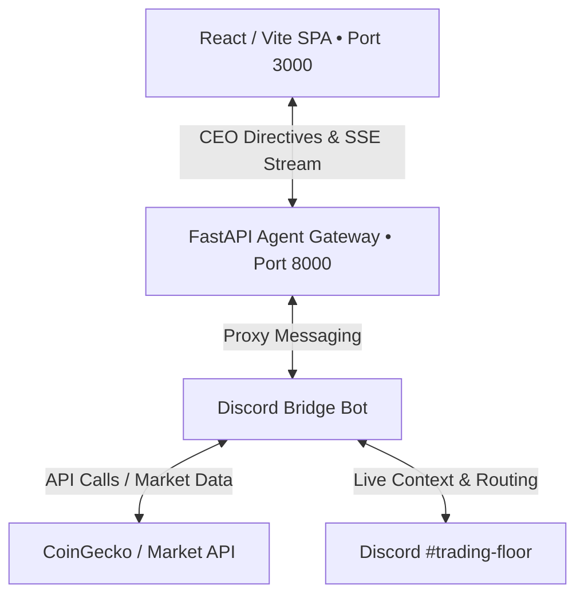

# OTTR HFT Cockpit: Polyglot Microservice System

OTTR is a quantitative dashboard for cryptocurrency markets, utilizing a polyglot microservice architecture designed to handle real-time market data analytics and automated multi-agent consensus trade logic.

---

## System Architecture Overview



### Polyglot Microservices

1. **Frontend (`/frontend`)**
   - **Stack**: React 19, Vite 6, Tailwind CSS v4, Lucide Icons.
   - **Role**: High-fidelity trading terminal cockpit. Features a clean, flat-design 8-agent status grid and a live CEO directive input terminal.
2. **Agent Gateway (`/agent-gateway`)**
   - **Stack**: Python 3.12, FastAPI, Uvicorn, Pydantic v2, HTTPX, SSE-Starlette.
   - **Role**: Serves Server-Sent Events (SSE) to the frontend for real-time agent state and execution logs, and proxies CEO directives from the React UI to the Discord Bridge.
3. **Discord Bridge (`/discord-bridge`)**
   - **Stack**: Python 3.12, Discord.py, SQLite, ChromaDB-style Vector Search.
   - **Role**: **The single source of truth for the system.** Connects the 8 OTTR agents to a Discord channel (`#trading-floor`). Features a Live LLM Intent Router, semantic memory, portfolio state management, and a fully functional order book simulator.
4. **Market Engine (`/market-engine`)** *(Legacy/Standby)*
   - **Stack**: Java 21, Spring Boot 3.3.6.
   - **Role**: Legacy execution engine for limit order book construction and Binance API dual-mode rate limiting. (Execution is currently managed by the Discord Bridge).

---

## Directory Structure

```
d:\crypto-trading-bot/
├── frontend/                 # React SPA (Vite + Tailwind v4)
├── agent-gateway/            # Python FastAPI Agent service
├── discord-bridge/           # Discord AI Agent Hub (Memory, Router, Chat)
├── market-engine/            # Java Spring Boot Matching Engine (Standby)
├── docker-compose.yml        # Orchestration configurations
├── .env.example              # Environment variables template
└── README.md                 # System documentation
```

---

## Quickstart: Run via Docker Compose

Make sure you have [Docker](https://www.docker.com/) and Docker Compose installed, then follow these steps:

1. **Configure Environment Variables**
   Copy the `.env.example` file and customize if needed:
   ```bash
   cp .env.example .env
   ```

2. **Launch the Containers**
   Build and start the entire microservice stack:
   ```bash
   docker compose up --build
   ```

3. **Access Services**
   - **React Cockpit**: [http://localhost:3000](http://localhost:3000)
   - **FastAPI Documentation**: [http://localhost:8000/docs](http://localhost:8000/docs)

---

## Local Development Setup

If you prefer to run services individually without Docker:

### 1. Python Agent Gateway
Ensure you have **Python 3.12+** installed:
```bash
cd agent-gateway
python -m venv .venv
source .venv/bin/activate # On Windows: .venv\Scripts\activate
pip install -e .
uvicorn app.main:app --host 127.0.0.1 --port 8000 --reload
```
*Runs on port `8000`.*

### 2. React Frontend
Ensure you have **Node.js 22+** installed:
```bash
cd frontend
npm install
npm run dev
```
*Runs on port `5173` (Vite dev server).*

### 3. Discord Bridge
Ensure you have **Python 3.12+** installed and your `DISCORD_TOKEN` set in `.env`:
```bash
cd discord-bridge
python -m venv .venv
source .venv/bin/activate # On Windows: .venv\Scripts\activate
pip install -r requirements.txt
python -m bot.main
```

---

## Discord Bridge Capabilities & CEO Terminal

The Discord Bridge is the core execution engine. The React Cockpit acts as a window into this bridge, allowing the CEO (human user) to interact live with the trading agents in the Discord channel (`#trading-floor`) directly from the web UI.

### Live LLM Intent Router
Every message typed into the React CEO Terminal is proxied to the Discord bot and parsed by an LLM intent router which categorizes the message:
1. **`[QUEUE]`**: General strategy notes are saved and injected into the next scheduled consensus meeting.
2. **`[EMERGENCY]`**: Words like "Emergency" wake up the entire team instantly for a live roundtable discussion.
3. **`[DIRECT:agent]`**: If you ping an agent or ask a direct question, the router fetches their Live Context, processes your request, and has them reply directly in chat, with the ability to execute tools (e.g., updating `min_trade_usd`).

### Short-Term & Semantic Long-Term Memory
- **Short-Term Context**: Agents automatically fetch the recent messages in the Discord channel for fluid follow-up conversations.
- **Long-Term Context**: A local SQLite vector database automatically saves transcripts of every trading meeting and decision. During live responses or new meetings, the bot uses **Semantic Search** to pull historical meetings that match current market conditions.

### Agent Order Book & Autonomy
Agents trade using an internal **Limit Order Book** simulated in the Discord bot. They can place Take Profits and Stop Losses, and a 60-second background ticker loops through active limits against CoinGecko prices. If a stop-loss is triggered, the bot automatically schedules an emergency meeting.
