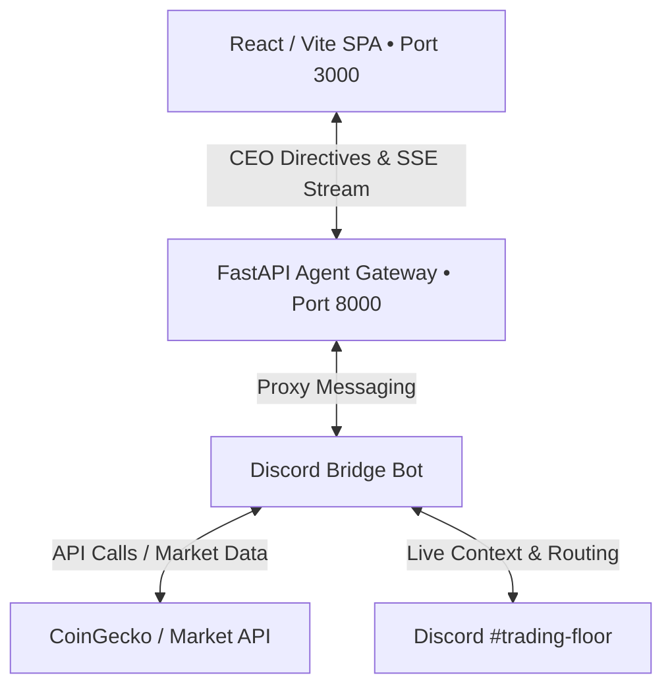

# OTTR: AI Agent Trading System

OTTR is a dashboard for cryptocurrency markets, driven by a cooperative multi-agent AI system operating out of a Discord channel. It utilizes a modular microservice architecture to link a high-fidelity React web terminal directly to the Discord autonomous trading floor.

---

## The Discord Trading Floor (Core Feature)

The defining feature of OTTR is its 7 autonomous AI agents, living and interacting within a Discord channel (`#trading-floor`). The React Web UI acts as a window into this bridge, allowing the CEO (human user) to interact live with the trading agents seamlessly from the web UI.

### Live CEO Directives & Intent Routing
Every message typed into the React UI is proxied to the Discord bot. The **CEO Handler** parses these inputs to either intercept them as overriding portfolio directives (injected into the next consensus meeting) or route them via an LLM Intent Router for direct agent communication.

### Consensus Meetings & Strict Phases
The system relies on a dual-trigger scheduler (4-hour cron + agent-invoked dynamic meetings). Meetings run with strict prompt constraints:
- **Phase 1 (Independent Report):** Agents provide an initial assessment based on the data, without voting.
- **Phase 2 (Debate Round):** Agents review their peers' reports, push back on disagreements, and cast a mandatory `- Final Vote`. The Meeting Chair tallies this post-debate consensus to execute native tool calls.

### Short-Term & Semantic Long-Term Memory
- **Short-Term Context**: Agents automatically fetch the recent messages in the Discord channel for fluid follow-up conversations.
- **Long-Term Context**: Transcripts of every trading meeting and decision are saved as Markdown files in a local vault. During live responses or new meetings, the bot uses the **Vesper Text** engine (TF-IDF semantic search) to pull historical context packets that match current market conditions.

### Market Data Guardrails & Execution Autonomy
Agents execute trades using native system tools. The `bot/price_feed.py` automatically falls back between multiple data APIs (CoinGecko -> CoinCap). If APIs fail, it injects highly-visible "Stale Data" warnings into the agent context, allowing the Risk Auditor to dynamically adapt to lagging data.

---

## System Architecture Overview



### Microservices

1. **Discord Bridge (`/discord-bridge`)**
   - **Stack**: Python 3.12, Discord.py, Local JSON/Markdown state, Vesper TF-IDF Engine (scikit-learn).
   - **Role**: **The single source of truth for the system.** Connects the 7 OTTR agents to a Discord channel (`#trading-floor`). Features a Live LLM Intent Router, semantic memory, portfolio state management, and a fully functional order book simulator.
2. **Frontend (`/frontend`)**
   - **Stack**: React 19, Vite 6, Tailwind CSS v4, Lucide Icons.
   - **Role**: High-fidelity trading terminal. Features a clean, flat-design 7-agent status grid and a live directive input terminal.
3. **Agent Gateway (`/agent-gateway`)**
   - **Stack**: Python 3.12, FastAPI, Uvicorn, Pydantic v2, HTTPX, SSE-Starlette.
   - **Role**: Serves Server-Sent Events (SSE) to the frontend for real-time agent state and execution logs, and proxies directives from the React UI to the Discord Bridge.

---

## Directory Structure

```
d:\crypto-trading-bot/
├── discord-bridge/           # Discord AI Agent Hub (Memory, Router, Chat)
├── frontend/                 # React SPA (Vite + Tailwind v4)
├── agent-gateway/            # Python FastAPI Agent service
├── docker-compose.yml        # Orchestration configurations
├── .env.example              # Environment variables template
└── README.md                 # System documentation
```

---

## Quickstart: Run via Docker Compose

Make sure you have [Docker](https://www.docker.com/) and Docker Compose installed, then follow these steps:

1. **Configure Environment Variables**
   Copy the `.env.example` file and customize if needed:
   ```bash
   cp .env.example .env
   ```

2. **Launch the Containers**
   Build and start the entire microservice stack:
   ```bash
   docker compose up --build
   ```

3. **Access Services**
   - **React Terminal**: [http://localhost:3000](http://localhost:3000)
   - **FastAPI Documentation**: [http://localhost:8000/docs](http://localhost:8000/docs)

---

## Local Development Setup

If you prefer to run services individually without Docker:

### 1. Discord Bridge
Ensure you have **Python 3.12+** installed and your `DISCORD_TOKEN` set in `.env`:
```bash
cd discord-bridge
python -m venv .venv
source .venv/bin/activate # On Windows: .venv\Scripts\activate
pip install -r requirements.txt
python -m bot.main
```

### 2. Python Agent Gateway
Ensure you have **Python 3.12+** installed:
```bash
cd agent-gateway
python -m venv .venv
source .venv/bin/activate # On Windows: .venv\Scripts\activate
pip install -e .
uvicorn app.main:app --host 127.0.0.1 --port 8000 --reload
```
*Runs on port `8000`.*

### 3. React Frontend
Ensure you have **Node.js 22+** installed:
```bash
cd frontend
npm install
npm run dev
```
*Runs on port `5173` (Vite dev server).*
